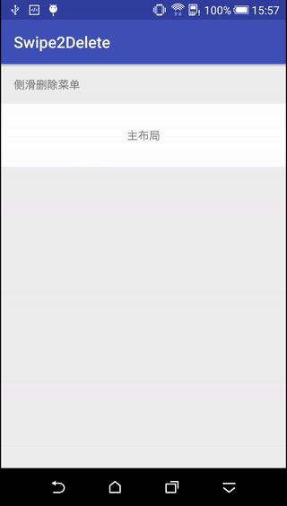
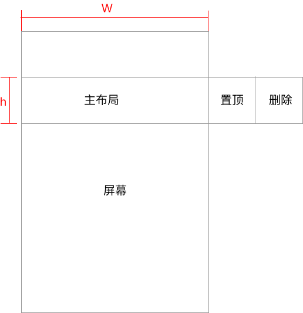
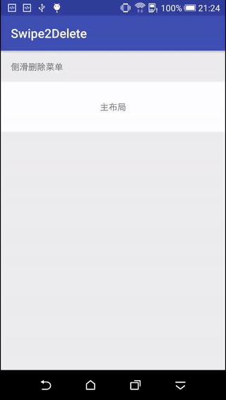

#前言

最近的这段时间真是忙到飞起，各种需求各种bug，心好累。

这个侧滑删除的自定义ViewGroup本来在11月份的时候就开始写的，中间一直放在那没动，这两天正好空下来，赶紧抽时间把这个项目写完了，事情也算是有个了结，不然总放在心里搁着，闷得慌，而且今天刚好是2017年1月5号，发工资的日子，而且元旦也刚过不久，好事成双，就当是送给自己的礼物了。

先看看效果图吧。



功能都在效果图里，就不介绍了，先看看这个控件的用法。

#项目使用
MainActivity.java

```
public class MainActivity extends AppCompatActivity {

    private Swipe2DeleteViewGroup mSwipe2Delete;

    @Override
    protected void onCreate(Bundle savedInstanceState) {
        super.onCreate(savedInstanceState);
        setContentView(R.layout.activity_main);

        mSwipe2Delete = (Swipe2DeleteViewGroup) findViewById(R.id.swipe2delete);
        mSwipe2Delete.setOnItemClickListener(new Swipe2DeleteViewGroup.OnItemClickListener() {
            @Override
            public void onItemClick(View view, int index, boolean isCenterView) {
                if (view instanceof TextView) {
                    TextView textView = (TextView) view;
                    String str = textView.getText().toString();
                    Toast.makeText(MainActivity.this, String.format("%s , isCenterView: %s", str, isCenterView), Toast.LENGTH_SHORT).show();
                }
            }
        });
    }
}
```
activity_main.xml

```
<?xml version="1.0" encoding="utf-8"?>
<LinearLayout xmlns:android="http://schemas.android.com/apk/res/android"
    xmlns:tools="http://schemas.android.com/tools"
    android:layout_width="match_parent"
    android:layout_height="match_parent"
    android:orientation="vertical"
    tools:context="com.xiaohongshu.swipe2delete.MainActivity">

    <TextView
        android:id="@+id/tv"
        android:layout_width="match_parent"
        android:layout_height="50dp"
        android:gravity="center_vertical"
        android:paddingBottom="@dimen/activity_vertical_margin"
        android:paddingLeft="@dimen/activity_horizontal_margin"
        android:paddingRight="@dimen/activity_horizontal_margin"
        android:paddingTop="@dimen/activity_vertical_margin"
        android:text="侧滑删除菜单" />

    <com.xiaohongshu.swipe2delete.Swipe2DeleteViewGroup
        android:id="@+id/swipe2delete"
        android:layout_width="match_parent"
        android:layout_height="80dp"
        android:background="@android:color/white">

        <TextView
            android:layout_width="match_parent"
            android:layout_height="match_parent"
            android:gravity="center"
            android:text="主布局" />

        <TextView
            android:layout_width="match_parent"
            android:layout_height="match_parent"
            android:background="@android:color/holo_green_light"
            android:gravity="center"
            android:text="置顶"
            android:textColor="@android:color/white" />

        <TextView
            android:layout_width="match_parent"
            android:layout_height="match_parent"
            android:background="@android:color/holo_green_light"
            android:gravity="center"
            android:text="测试"
            android:textColor="@android:color/white"
            android:visibility="gone" />

        <TextView
            android:layout_width="match_parent"
            android:layout_height="match_parent"
            android:background="@android:color/holo_red_light"
            android:gravity="center"
            android:text="删除"
            android:textColor="@android:color/white" />

    </com.xiaohongshu.swipe2delete.Swipe2DeleteViewGroup>
</LinearLayout>
```
因为定义的这个ViewGroup直接把第一个子View当成中间要显示的View，其他的View都当成了需要侧滑才显示出来的MenuItem，所以在布局里面可以直接调整布局，ViewGroup会在代码里帮你处理好其他的逻辑。

#实现过程
主要用到的知识点如下：

- 1、自定义ViewGroup
- 2、OnTouchEvent处理滚动逻辑
- 3、Scroller完成平滑滚动
- 4、OnTouchEvent处理点击事件
- 5、VelocityTracker实现速度追踪

上面列的这些是我写这个项目时候依次实现的功能，其实很多效果酷炫的自定义View也都是从基本的一点点来，然后慢慢的加各种效果，边加边调试，也不是一开始的时候就把所有的东西往上面加的，明白了这个道理，可能自定义View对很多人来说就会容易理解一些吧。

下面我就来从无到有一一介绍我实现这个项目的全部过程。

##自定义ViewGroup
不管是平时面试，还是在网上看别人的博客，一涉及到自定义ViewGroup的实现过程，无非就是onMeasure()、onLayout()、onDraw()，分别负责测量内容、摆放子View、绘制内容。

这种东西看的太多了，但是要是问起来要怎么去测量、摆放、绘制，对于很多人其实都是答不上来的。

###onMeasure()
对于这个项目，大致结构如下：



在初始状态下，主布局是显示在屏幕上的，高度等于ViewGroup的高度，宽度等于ViewGroup的宽度，这里假设宽度为W。

而对于屏幕外的两个MenuItem，由于要显示成正方形的样子，所以他们的宽高都是ViewGroup的高度，这里假设为h。当然这个只是我的个人喜好，实际上也看项目需求了。

有了上面这两条要求，在ViewGroup的onMeasure中我们就知道该如何进行测量了。

测量分为`对子View测量`和`对ViewGroup自身进行测量`。根据上面的描述，主布局的宽和高应该是W和h，而两个MenuItem的宽和高应该分别为h。那么整个ViewGroup的宽是不是就应该是W+2h了呢？

实际上我这里算的ViewGroup的宽却是W。为什么呢？

其实你可以这么想，View本身是没有边界的，只是手机屏幕有边界，就好比你在旅行的时候拍照，路上的风景就可以当成一个照相机ViewGroup中的内容，拍出来的照片就是ViewGroup当前显示在手机屏幕上的样子，随着取景框从左到右移动，照片中右边的风景也显示到了左边。

然而实际上风景一般都是不移动的，就好比ViewGroup画在手机上，手机屏幕是没法移到手机壳外面，但移动是相对的，虽然风景没法移动，但是我们可以移动取景框；虽然手机屏幕没法移动，但是我们可以移动ViewGroup中的内容。

所以我们侧滑滚动的时候，滚动的其实是ViewGroup中的内容，而不是ViewGroup本身，这样是不是就很好理解了。（如果宽度算成W+2h的话也是可以实现的，只不过外面需要套一层HorizontalScrollView来实现滚动，这样的话滚动的就不是ViewGroup中的内容，而是ViewGroup本身了。）

叨叨逼逼这么久，上代码吧：

```
    @Override
    protected void onMeasure(int widthMeasureSpec, int heightMeasureSpec) {
        super.onMeasure(widthMeasureSpec, heightMeasureSpec);

        int widthMode = MeasureSpec.getMode(widthMeasureSpec);
        int widthSize = MeasureSpec.getSize(widthMeasureSpec);
        int heightMode = MeasureSpec.getMode(heightMeasureSpec);
        int heightSize = MeasureSpec.getSize(heightMeasureSpec);

        mCenterView = null;

        int childCount = getChildCount();
        for (int i = 0; i < childCount; i++) {
            View child = getChildAt(i);
            if (child.getVisibility() == GONE) {
                continue;
            }
            int childWidth;
            if (mCenterView == null) {
                mCenterView = child;
                childWidth = MeasureSpec.makeMeasureSpec(widthSize, MeasureSpec.EXACTLY);
            } else {
                childWidth = heightMeasureSpec;
            }
            child.measure(childWidth, heightMeasureSpec);
        }
        setMeasuredDimension(widthSize, heightSize);
    }
```
代码第5~8行，分别取出宽高的测量模式、测量大小。

第10行，保存主布局的子View。

第14~17行，遍历所有子View，并且跳过`Visilility`为`Gone`的子View。

第19~23行，如果当前子View是主布局，则指定其宽度为ViewGroup的宽度；否则指定其宽度为ViewGroup的高度。（这样它就是一个正方形了）

第25行，将计算出来的子View宽高应用到该子View上，这一步很重要！通过这一步之后，主布局的宽高就变成了W和h，所有MenuItem的宽高就都变成了h了。

第27行，遍历完所有子View之后，将计算出来的ViewGroup的宽高应用到自身，否则不生效。第25步是测量子View，这里是测量ViewGroup自身，非常重要！

###onLayout()
测量完ViewGroup及其子View之后，现在来对其进行摆放。按照上面的结构图很容易理解，所有的子View都是水平摆放，其中主布局的宽高是W和h，MenuItem的宽高都是h。

下面的代码就很好理解了：

```
    @Override
    protected void onLayout(boolean changed, int l, int t, int r, int b) {

        int childCount = getChildCount();
        int offset = 0;
        for (int i = 0; i < childCount; i++) {
            View child = getChildAt(i);
            if (child.getVisibility() == GONE) {
                continue;
            }
            setChildFrame(child, offset, 0, child.getMeasuredWidth(), child.getMeasuredHeight());
            offset += child.getMeasuredWidth();
        }
    }

    private void setChildFrame(View child, int left, int top, int width, int height) {
        child.layout(left, top, left + width, top + height);
    }
```
代码第7~10行，遍历所有子View，如果`visibility`是`Gone`，则跳过。

第11行，实际调用的是`child.layout(left, top, left + width, top + height)`，分别确定子View的左上右下分别相对ViewGroup的位置。其中offset用来记录偏移位置。

比如子View是主布局时，偏移是0；子View是第1个MenuItem时，偏移是W；子View是第2个MenuItem时，偏移是W+h；以此类推。。。

这样就可以确定所有子View的位置了。

至此，侧滑删除ViewGroup就基本实现了，不过显示在屏幕外的MenuItem还看不到，现在来加上侧滑滚动逻辑，来让MenuItem可以侧滑出来。

##OnTouchEvent处理滚动逻辑
上面说了，侧滑滚动的原理其实是让ViewGroup中的内容滚动，而不是滚动ViewGroup本身。

所以实现逻辑也就出来了：

- 当手指在ViewGroup上从右往左滑动，则让ViewGroup中的内容从右往左滚动，从而让MenuItem进行显示。
- 当手指在ViewGroup上从左往右滑动，则让ViewGroup中的内容从左往右滚动，从而让MenuItem进行隐藏。

当然，上面两个逻辑还要进行边界判断，比如如果ViewGroup中的MenuItem都已经全部显示出来，此时ViewGroup中的内容就不能继续从右往左滚动了。

滚动ViewGroup中的内容可以用`scrollTo()`或者`scrollBy()`，具体含义可以百度。很多人对`scrollBy()`这个方法感到很困惑，为什么`scrollBy(10,0)`是基于当前位置左移了10个像素，而不是右移。

之前说了可以把风景当成ViewGroup中的内容，照相机拍出来的照片表示ViewGroup显示在手机屏幕上的样子。那你把照相机的取景框从右往左移动，拍出来的照片里面的风景是不是左移了呢？

这是一个道理，你把`scrollBy(10,0)`就当成移动照相机的取景框往右移动了10个像素就行了，这样拍出来的照片里风景就往左移了10个像素。

风景是没有边界的，有边界的是你照相机的取景框；ViewGroup的内容也是没有边界的，有边界的是你的手机屏幕。

结合我们的项目，当手指在ViewGroup水平方向上从右往左移动`x`个像素时，ViewGroup中的内容也应该从右往左滚动`x`个像素，则取景框应该从左至右移动`x`个像素，即`scrollBy(x,0)`。

绕晕了没？反正我是晕了。算的时候最好用笔在纸上画出来，不然容易搞混。

明白了这些，下面的代码就很简单了。

```
    @Override
    public boolean onTouchEvent(MotionEvent event) {
        super.onTouchEvent(event);
        switch (event.getAction()) {
            case MotionEvent.ACTION_DOWN:

                break;
            case MotionEvent.ACTION_MOVE:

                updateScrollX(mLastTouchX - event.getRawX());
                break;
            case MotionEvent.ACTION_UP:
            case MotionEvent.ACTION_CANCEL:

                toggleStatus();
                break;
        }
        mLastTouchX = event.getRawX();
        return true;
    }

    private void toggleStatus() {
        int scrollThreshold = getMeasuredHeight();
        if (mScrollX < scrollThreshold) {

            hideMenu();
        } else if (mScrollX > scrollThreshold) {

            showMenu();
        }
    }

    /**
     * 显示菜单
     */
    private void showMenu() {

        mStatus = STATUS_EXPAND;
        updateScrollX(mMaxScrollDistance);
    }

    /**
     * 隐藏菜单
     */
    private void hideMenu() {

        mStatus = STATUS_NORMAL;
        updateScrollX(-mMaxScrollDistance);
    }

    private void updateScrollX(float distance) {

        float dx = mScrollX + distance;
        if (dx < mMinScrollDistance) {

            dx = mMinScrollDistance;
        } else if (dx > mMaxScrollDistance) {

            dx = mMaxScrollDistance;
        }
        mScrollX = dx;
        scrollTo((int) dx, 0);
    }
```
还需要注意几点：

- 第10行，更新滚动距离的时候，要考虑滚动边界。
- 第15行，手指抬起或取消滚动时，要将MenuItem进行完全展开或隐藏，避免处于中间态。
- 第18行，要及时更新上一次触摸事件的`x坐标`。
- 第19行，一定要返回true，如果ACTION_DOWN的时候不返回true，后面的一系列事件就都收不到了。


##Scroller完成平滑滚动
上面滚动的时候直接调用View自带的`scrollTo()`，这样交互上很生硬，用户体验不好，所以需要加上一个平滑滚动。

平滑滚动实现方式有很多种，我们这里用Scroller来实现。

其实Scroller本身并不负责ViewGroup的平滑滚动，它只是在内部计算好了滚动时某个时刻ViewGroup应该处在的位置`(x,y)`，然后ViewGroup调用`scrollTo(x,y)`来实现真正的滚动，Scroller并不能让ViewGroup发生真实的滚动，而是通过使上面的`(x,y)`根据动画插值器产生各种线性、非线性的变化，而这种变化在很短时间内差值非常小，所以ViewGroup调用`scrollTo(x,y)`来实现滚动时就能产生各种速率的平滑滚动了。

具体原理可以自行百度，我就不重复造轮子了。

至于代码，在经过上一步的处理之后，加上Scroller还是很简单的。

首先定义Scroller对象并在构造方法中初始化：

```
    private Scroller mScroller;

    public Swipe2DeletePart3(Context context, AttributeSet attrs, int defStyleAttr) {
        super(context, attrs, defStyleAttr);
        mScroller = new Scroller(context);
    }
```
然后分别实现`smoothScrollTo()`和`smoothScrollBy()`两个方法：

```
    private void smoothScrollTo(int fx, int fy) {
        int dx = fx - mScroller.getFinalX();
        int dy = fy - mScroller.getFinalY();
        smoothScrollBy(dx, dy);
    }

    private void smoothScrollBy(int dx, int dy) {
        mScroller.startScroll(mScroller.getFinalX(), mScroller.getFinalY(), dx, dy);
        invalidate();
    }
```
其中`getFinalX()`即表示ViewGroup停止滚动时的x坐标。

第2~3行，即分别计算出目标位置和当前滚动的结束位置之间的差值。

第4行，调用`smoothScrollBy()`来完成。

第8行，调用`mScroller.startScroll()`来实现`“滚动”（其实只是开始替ViewGroup计算滚动的目标位置）`：

- 前面两个参数为Scroller上次滚动时的结束位置（防止滚动未完成又开始新一轮滚动时，中间未完成的滚动被丢弃从而发生跳跃性滚动的效果，这样不友好）
- 后面两个参数即表示偏移距离

第9行，看过Scroll滚动原理的朋友应该知道，这里调用`invalidate()`是为了触发`computeScroll()`，从而使ViewGroup发生真正的滚动。

那么，来看看`computeScroll()`中的代码吧：

```
    @Override
    public void computeScroll() {
        if (mScroller.computeScrollOffset()) {
            scrollTo(mScroller.getCurrX(), mScroller.getCurrY());
            postInvalidate();
        }
        super.computeScroll();
    }
```
上面说了，在`smoothScrollBy()`中调用`invalidate()`是为了触发`computeScroll()`。

第3行，如果Scroller的动画效果还没有结束，则说明Scroller产生的滚动效果尚未完成，需要继续滚动。

第4行，ViewGroup真正发生滚动的地方，通过`mScroller.getCurrX()`来获取ViewGroup当前应该滚动的位置，然后调用`scrollTo()`来发生真正的滚动。

第5行，为了使`scrollTo()`的滚动效果立即生效。

至此，侧滑删除自定义ViewGroup的功能就基本完成一半啦，现在就可以看到侧滑的平滑滚动菜单效果了。


##OnTouchEvent处理点击事件
这一部分主要是处理手指抬起时的逻辑，如果：

- 当手指抬起时，`MotionEvent`的坐标和按下时的坐标相差不大
- 当手指抬起时，`MotionEvent`发生的时间和按下时的时间相差不大

则可以认为本次`MotionEvent`是点击事件。所以根据上面的描述，我们只看`MotionEvent.ACTION_DOWN`和`MotionEvent.ACTION_UP`这两个事件就行了：

```
    private static final int HOVER_TAP_SLOP = 10;
    private static final int HOVER_TAP_TIMEOUT = 150;

    @Override
    public boolean onTouchEvent(MotionEvent event) {
        super.onTouchEvent(event);
        switch (event.getAction()) {
            case MotionEvent.ACTION_DOWN:
                mMoveDownEvent = MotionEvent.obtain(event);
                break;
            case MotionEvent.ACTION_MOVE:

                updateScrollX(mLastTouchX - event.getRawX());
                break;
            case MotionEvent.ACTION_UP:
                int downX = (int) mMoveDownEvent.getRawX();
                int downY = (int) mMoveDownEvent.getRawY();
                //如果事件坐标在以按下时坐标为中心的宽度为 2 * HOVER_TAP_SLOP 的正方形内,则认为这个事件是点击事件
                Rect rect = new Rect(downX - HOVER_TAP_SLOP, downY - HOVER_TAP_SLOP, downX + HOVER_TAP_SLOP, downY + HOVER_TAP_SLOP);
                //如果按下手指和抬起手指时的 坐标和时间 相差不是很大,则可以认为是点击
                boolean intent2Click = rect.contains((int) event.getRawX(), (int) event.getRawY());
                boolean isTimeNotTooLong = event.getEventTime() - event.getDownTime() < HOVER_TAP_TIMEOUT;
                if (intent2Click && isTimeNotTooLong) {

                    handleClickEvent(event);
                } else {

                    toggleStatus();
                }
                break;
            case MotionEvent.ACTION_CANCEL:
                toggleStatus();
                break;
        }
        mLastTouchX = event.getRawX();
        return true;
    }
```
代码第1~2行，从`ViewConfiguration`类中找出来的值，含义分别如下：

- 定义从触摸屏幕到释放之时判断是点击事件的允许移动的最大距离（超过了这个距离就不是点击，而被认为是手势了）。
- 定义从触摸屏幕到释放之时判断是点击事件的允许移动的最长时间（超过了这个时间就不是点击，而被认为是手势了）。

第9行，记录按下时的`MotionEvent`。

第16~16行，如果手指抬起时与按下时移动的距离和触摸的时间都在允许误差之内，则认为是点击，并处理相关的点击逻辑。

第26~29行，处理手势滑动相关的逻辑。

在25行，调用`handleClickEvent()`处理点击相关逻辑。

这部分比较简单，主要是遍历所有的子View，判断`MotionEvent`有没有落在该子View当中，如果找到了该View，则认为该子View需要处理本次点击事件，然后执行相关逻辑即可。

需要注意的是，如果点击的是主布局，但是此时处于MenuItem展开的状态，则这次点击需要先将MenuItem收起来，下次再点击时则让主布局响应点击事件。

即菜单展开时，主布局是不可以响应点击事件的，要先收起MenuItem。

代码如下：

```
    private void handleClickEvent(MotionEvent event) {

        int index = 0;
        int childCount = getChildCount();
        for (int i = 0; i < childCount; i++) {
            View child = getChildAt(i);
            if (child.getVisibility() == GONE) {
                continue;
            }
            if (isMotionEventInView(child, event)) {
                //如果点击的是主item,如果当前是菜单展开状态,则先收起菜单,并消费此次点击
                if (child == mCenterView && mStatus != STATUS_NORMAL) {

                    hideMenu();
                } else if (null != mOnItemClickListener) {

                    mOnItemClickListener.onItemClick(child, index, child == mCenterView);
                }
                break;
            }
            index++;
        }
    }

    /**
     * 判断点击事件是否在view中
     *
     * @param view
     * @param event
     * @return
     */
    private boolean isMotionEventInView(View view, MotionEvent event) {
        int[] location = new int[2];
        view.getLocationOnScreen(location);
        int x = location[0];
        int y = location[1];
        boolean isBeyondLeft = event.getRawX() < x;
        boolean isBeyondTop = event.getRawY() < y;
        boolean isBeyondRight = event.getRawX() > (x + view.getMeasuredWidth());
        boolean isBeyondBottom = event.getRawY() > (y + view.getMeasuredHeight());
        return !isBeyondLeft && !isBeyondTop && !isBeyondRight && !isBeyondBottom;
    }
```


##VelocityTracker实现速度追踪
代码写到这里，侧滑菜单的主要逻辑其实都实现了，这部分其实是属于优化啦。

之前手指抬起时判断菜单是需要展开还是收起的时候，直接判断如果滚动距离大于一个MenuItem的宽度则让其展开，否则就收起。

但是这样并不是完美的解决方案，试想如果用户在屏幕上用力的一滑，但是ViewGroup滚动的距离并不够一个MenuItem的宽度，这时候菜单还是不能展开，实际上这样的体验是非常不好的。

所以我们需要进行速度追踪，如果用户手指滑动的够快，那么即使ViewGroup滑动的距离不够一个MenuItem的宽度，那么仍然可以让MenuItem全部展开。

这才是一个好的用户体验。

要实现速度追踪，使用`VelocityTracker`即可，方法同样非常简单。

- 1、定义`VelocityTracker`
- 2、在`ACTION_DOWN`中初始化`VelocityTracker`，并将`event`添加进去
- 3、添加每次`ACTION_MOVE`事件发生时的`event`
- 4、在`ACTION_UP`中使用`VelocityTracker.computeCurrentVelocity(1000)`计算出此刻的速度`v`
- 5、如果`v的绝对值`比容错值要大，则表示这是用力的滑动
 - 1、如果`v`大于0，表示从左往右滑动，应该隐藏菜单
 - 2、否则表示从右往左滑动，应该显示菜单
- 6、回收`VelocityTracker`
 
 至此，速度追踪也实现啦。
 

 
关于
--

博客：[http://blog.csdn.net/aishang5wpj](http://blog.csdn.net/aishang5wpj)

邮箱：337487365@qq.com

License
--
Copyright 2017 aishang5wpj

Licensed under the Apache License, Version 2.0 (the "License"); you may not use this file except in compliance with the License. You may obtain a copy of the License at

http://www.apache.org/licenses/LICENSE-2.0

Unless required by applicable law or agreed to in writing, software distributed under the License is distributed on an "AS IS" BASIS, WITHOUT WARRANTIES OR CONDITIONS OF ANY KIND, either express or implied. See the License for the specific language governing permissions and limitations under the License.